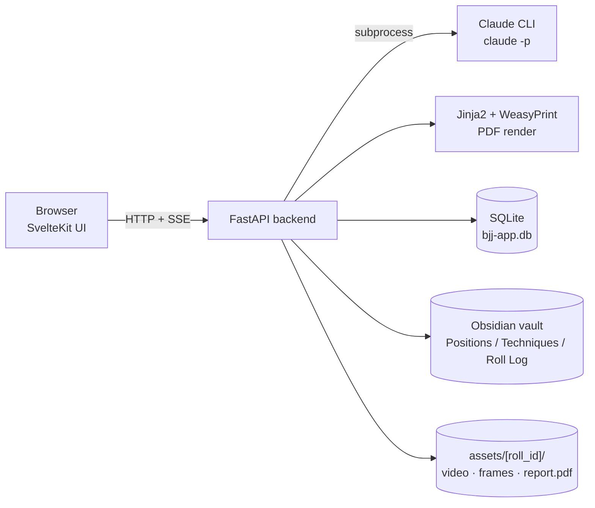

# BJJ Analysis

Obsidian vault + local web app for reviewing BJJ rolling footage. Upload a video, pick sections of interest, let Claude generate per-section narratives and a coaching summary, annotate, and save a scored report back to the vault as markdown — plus a printable PDF.

Runs entirely on your Mac. No cloud services, no API keys — uses the `claude` CLI signed into your Claude subscription.

## Architecture



**Per-roll flow:**

1. **Upload** video → row in SQLite, file under `assets/<roll_id>/`. Capture player A/B names + appearance hints on the upload form.
2. **Pick sections** of interest by playing the video and pressing *Mark start* / *Mark end*. Sections are user-driven — the app does not auto-detect.
3. **Analyse** → one Claude call per section. Up to 8 frames sampled at 1 fps, fed to Claude with a vocabulary-grounded prompt (see below) → returns `{narrative, coach_tip}`.
4. **Annotate** free-text coaching notes per section.
5. **Finalise (Summarise)** → one Claude call across all analysed section narratives + your annotations → returns `{summary, scores, top_improvements, strengths, key_moments}`.
6. **Save to Vault** → splices the summary into `Roll Log/<date> - <title>.md` under hash-guarded section markers.
7. **Export PDF** → Jinja2 template rendered by WeasyPrint; writes `assets/<roll_id>/report.pdf` and wikilinks it from the vault markdown.

## How the analysis works

Three Claude interactions per roll, all via the local `claude -p` subprocess (subscription-backed, not API-keyed):

1. **Section narrative + coach_tip** (one call per user-picked section).
2. **Roll summary + scores + key moments** (one call per roll, once you hit Finalise).
3. *(Eval only, not on the live path)* **LLM-as-judge** calls used by `python -m server.eval` to compare prompt variants offline. See `tools/bjj-app/server/eval/README.md`.

### Phase 1 — Upload

```
POST /api/rolls  (multipart form)
    │
    ├─► save video to  assets/<roll_id>/source.mp4
    ├─► ffprobe → duration_s
    ├─► insert into rolls(id, title, date, video_path, duration_s,
    │                     player_a_name, player_b_name,
    │                     player_a_description, player_b_description)
    └─► return roll_id
```

No Claude call yet. No frames extracted. Player names + appearance descriptions are stored once — they flow into every downstream Claude call so tagging stays consistent.

### Phase 2 — Section analysis (M9b, runs per user-picked range)

Trigger: `POST /api/rolls/:id/analyse` with `sections=[{start_s, end_s}, …]`. SSE stream back to the browser so each section's progress is visible.

Inside `run_section_analysis` (`server/analysis/pipeline.py`), for each range sequentially:

```
Section i of N
│
├─── 1) Frame timestamp selection
│       duration = end_s − start_s
│       n = min(8, max(1, round(duration)))   ← 1 fps, 8-frame hard cap
│       return evenly-spaced timestamps across [start_s, end_s)
│
├─── 2) Frame extraction (OpenCV)
│       cv2.VideoCapture.set(CAP_PROP_POS_MSEC, …)
│       write JPEG → assets/<roll_id>/frames/frame_NNNNNN.jpg
│       (NNNNNN = auto-incremented global index on moments table)
│
├─── 3) Persist section + moments  (append-only)
│       sections(id, roll_id, start_s, end_s, sample_interval_s=1.0)
│       moments(frame_idx, timestamp_s, section_id)
│       SSE: {"stage":"section_started", ...}
│
├─── 4) Assemble prompt  (see below)
│
├─── 5) run_claude(prompt)  ← rate-limited subprocess
│       claude -p --model claude-opus-4-7 \
│                 --output-format stream-json \
│                 --include-partial-messages \
│                 --max-turns 1 \
│                 --dangerously-skip-permissions \
│                 --verbose \
│                 "<prompt text with @frame_path refs>"
│       Rate limit: 10 calls / 300 s (SlidingWindowLimiter).
│       On RateLimitedError → SSE "section_queued", sleep, retry ≤ 3×.
│
├─── 6) Parse response
│       json.loads → validate {narrative, coach_tip} schema
│       → SectionResponseError on bad JSON / missing fields
│
├─── 7) Persist narrative
│       UPDATE sections SET narrative=?, coach_tip=?, analysed_at=NOW()
│       SSE: {"stage":"section_done", ...}
│
└─── (next section)
```

Final event: `{"stage":"done","total":N}`.

#### The section prompt — what Claude actually sees

`build_section_prompt` in `server/analysis/prompt.py` stacks five blocks separated by blank lines:

**Block 1 — Preamble**
```
You are analysing a Brazilian Jiu-Jitsu sequence between
<player_a_name> (player_a in output) and <player_b_name> (player_b in output).
```

**Block 2 — Appearance hints** (only if descriptions were provided)
```
Use these appearance hints to keep player tagging consistent across frames:
- player_a (<a_name>): <a_description>
- player_b (<b_name>): <b_description>
```

**Block 3 — Frame manifest**
```
Below are <N> chronologically ordered frames spanning <duration>s of
footage. Review all frames as one continuous sequence and describe
what happens.

Frame 1 @t=3.0s: @/abs/path/to/frame_000000.jpg
Frame 2 @t=5.5s: @/abs/path/to/frame_000001.jpg
…
Frame N @t=Xs:   @/abs/path/to/frame_00000N.jpg
```
The `@path` tokens are resolved by the Claude CLI and uploaded as image inputs.

**Block 4 — Vocabulary grounding** (M10 + M12 + M13)

```
Canonical BJJ positions — use this exact vocabulary when identifying what
you see in the frames. Techniques commonly seen from each position are
listed inline under their source position:

- 50/50 (fifty_fifty): <authored `## How to Identify` body + Disambiguator
  vs `eighty_twenty`: … + vs `backside_fifty_fifty`: … + vs `inside_sankaku`: …>
  Techniques from here: Heel hook, Kneebar, Toe hold, Sweep to top 50/50, …
- 80/20 (Dominant 50/50) (eighty_twenty): <body>
  Techniques from here: Heel hook, Kneebar, Toe hold, …
- …44 positions total, taxonomy order, ~2.5k tokens…
```

And, **only when any leg-entanglement position is in the grounded list** (M13):

```
When the legs are tangled between the two players, disambiguate in this
order before naming the position:
1. Count trapped legs.  TWO legs mirror-trapped → 50/50 family.  ONE leg
   isolated → Ashi family.
2. Opponent's leg BETWEEN attacker's thighs + feet figure-foured
   → inside_sankaku (saddle / honey hole) — strongest heel-hook position.
3. Attacker's outside foot ACROSS opponent's body/hip → eighty_twenty
   or outside_ashi.
4. One player rotated back-to-back → backside_fifty_fifty or ushiro_ashi.
5. Opponent still standing / kneeling with V-shape on one leg → single_leg_x.
Then state whose heel is exposed past the hip — that is the threat.
```

**Block 5 — Guidance + output schema**

```
Describe the positions, transitions, who initiates what, and where the
sequence ends. Use standard BJJ vocabulary (e.g. "closed guard bottom",
"passes half guard to side control", "triangle attempt"). Follow with
one actionable coach tip directed at player_a.

Output ONE JSON object and nothing else. No prose outside JSON. No
markdown fences.
{
  "narrative":  "<one paragraph, 2-5 sentences>",
  "coach_tip":  "<one actionable sentence for player_a>"
}
```

**Total size**: roughly 6-8k tokens per section call today (2-3k grounding + 2-3k schema/preamble/frames + per-frame image payloads uploaded separately by the CLI).

Grounding is toggleable via the `BJJ_GROUNDING_MODE` env var — `positions+techniques` (live default, M12 + M13), `positions` (M10 behaviour), or `off` (M9b baseline).

### Phase 3 — Summarise (M6a, runs once when user clicks Finalise)

Trigger: `POST /api/rolls/:id/summarise`. Synchronous return, no SSE.

```
server.api.summarise.summarise_roll
│
├─── 1) Load roll_row from DB
├─── 2) Load all analysed sections (narrative + coach_tip + section_id + timings)
├─── 3) Load annotations keyed by section_id
├─── 4) build_summary_prompt(…)  ← assembly below
├─── 5) run_claude(prompt)       ← ONE call, text-only, no images
├─── 6) parse_summary_response(raw, valid_section_ids)
├─── 7) UPDATE rolls SET summary_json = <parsed>, summarised_at = NOW()
└─── 8) Return {summary, scores, top_improvements, strengths, key_moments}
```

#### The summary prompt — what Claude actually sees

```
You are a BJJ coach reviewing a roll. Analyse the sections below and
produce a concise coaching report. The practitioner is <A> (the person
being coached); <B> is their partner.

Roll metadata:
- Duration: MM:SS
- Date: YYYY-MM-DD
- Total sections analysed: N

Per-section analyses (chronological):

Section section_id=<uuid> (M1:S1 – M1:S2):
  Narrative: <the narrative from Phase 2>
  Coach tip: <the coach_tip from Phase 2>
  <A>'s notes:
    - <annotation body, if any>

Section section_id=<uuid2> (M2:S1 – M2:S2):
  …

Scoring rubric (calibrate each score against the footage provided, not
against BJJ practice as a whole — 10 means execution was reliable
throughout THIS roll):
- 0–3: needs focused work; frequent positional loss or stalled execution.
- 4–6: developing; skill is emerging but inconsistent under pressure.
- 7–10: reliable; consistent, technical execution against the partner in
  this footage.

Per-metric definitions:
- guard_retention: ability to recover / hold guard when pressured.
- positional_awareness: reads the partner's posture and responds with the
  right frame / grip / shape.
- transition_quality: technical fluency moving between positions
  (passes, sweeps, escapes).

Output ONE JSON object with this exact shape — no prose, no markdown fences:
{
  "summary": "<one-sentence summary>",
  "scores": {
    "guard_retention":       <integer 0..10>,
    "positional_awareness":  <integer 0..10>,
    "transition_quality":    <integer 0..10>
  },
  "top_improvements": ["<sentence>", "<sentence>", "<sentence>"],
  "strengths": ["<short phrase>", ...],
  "key_moments": [
    {"section_id": "<from the list above>", "note": "<brief pointer sentence>"},
    {"section_id": "<...>", "note": "<...>"},
    {"section_id": "<...>", "note": "<...>"}
  ]
}
```

Notably, **the summariser never sees the video frames** — only the Phase 2 narratives. If a section narrative hallucinated details, the summary faithfully repeats them.

`parse_summary_response` validates the structure and cross-checks every `key_moments[*].section_id` against the set of real section IDs — the model cannot invent a section.

### Known limitations (where hallucinations enter)

```
   ┌──────┬───────┬────────┬────────────────────┐
   │ Frames │ Preamble │ Grounding │ Guidance + schema │  ← Claude's input
   └──────┴───────┴────────┴────────────────────┘
                         │
                         ▼
           ┌─────────────────────────────┐
           │ Claude produces JSON:       │
           │  {"narrative": "…", ...}    │
           └─────────────────────────────┘
                         │
       No frame citation. No confidence. No self-check.
                         │
                         ▼
               Hallucinations land here
     ("wall", "stacked pass that didn't happen")
```

Three structural weaknesses of the current design:

1. **Narrative is free text** — nothing requires the model to tie a claim to a frame index or a canonical `position_id`. The model can invent a wall because nothing says "justify every claim."
2. **One-shot per section** — no internal self-check, no second opinion. The first JSON Claude writes is the final answer.
3. **Summary is blind to frames** — it only sees the narratives. Hallucinations at the section level compound into the summary unchanged.

Every milestone from M10 onward has worked on the **prompt** layer (vocabulary grounding, disambiguation rules, rubric). The **pipeline shape** — "extract frames → one Claude call → parse JSON → store" — has been stable since M9b. The next tier of accuracy work (multi-pass pre-classification, self-verification, structured output with frame citations, pose-feature layer) changes the pipeline, not the prompt.

## Quick start

One-time:

```bash
cd tools/bjj-app
brew install pango                              # for WeasyPrint
python3.12 -m venv .venv && .venv/bin/pip install -e .
cd web && npm install && npm run build
```

Run:

```bash
# Dev (hot-reload backend + Vite)
./tools/bjj-app/scripts/dev.sh
# → http://127.0.0.1:5173

# Production (builds frontend, binds 0.0.0.0)
./tools/bjj-app/scripts/run.sh
# → http://127.0.0.1:8000 (or http://<mac-lan-ip>:8000 from your phone)
```

Requires the `claude` CLI on `PATH`, signed in with an active subscription.

Env knobs (all optional):

| Variable | Default | Purpose |
|---|---|---|
| `BJJ_GROUNDING_MODE` | `positions+techniques` | `off` / `positions` / `positions+techniques` |
| `BJJ_CLAUDE_MAX_CALLS` | `10` | rate limit window size |
| `BJJ_CLAUDE_WINDOW_SECONDS` | `300` | rate limit window length |
| `BJJ_CLAUDE_BIN` | `~/.local/bin/claude` | path to the claude CLI |
| `BJJ_CLAUDE_MODEL` | `claude-opus-4-7` | model id passed to `claude -p --model` |

## Repo layout

```
.
├── tools/bjj-app/            # Live FastAPI + SvelteKit app
│   ├── server/               # Python backend
│   │   ├── analysis/         # prompt, pipeline, summarise, techniques_vault, positions_vault, …
│   │   ├── api/              # /rolls, /analyse, /summarise, /export_pdf, /vault, /graph
│   │   ├── eval/             # M11 LLM-as-judge harness (see its own README)
│   │   └── db.py             # SQLite schema + helpers
│   ├── scripts/              # dev.sh, run.sh, bootstrap_technique_notes.py, eval_progress.sh
│   ├── tests/backend/        # pytest (342 tests green as of M13)
│   └── web/                  # SvelteKit frontend
├── tools/taxonomy.json       # 44 positions + 115 techniques (load-bearing)
├── tools/GrappleMap.*        # Position-graph data (future grounding feature)
├── Positions/                # Obsidian position notes — wikilink graph + How to Identify
├── Techniques/               # Obsidian technique notes — How to Identify + Used from
├── Roll Log/                 # Per-roll coaching markdown (source of truth)
├── Templates/                # Obsidian templates
├── assets/<roll_id>/         # Video + extracted frames + exported PDF
├── docs/superpowers/         # Design specs + implementation plans
└── Home.md                   # Vault dashboard
```

## Obsidian vault

Open the repo root as an Obsidian vault to explore `Positions/`, `Techniques/`, and `Roll Log/` as an interconnected knowledge graph. Start at **Home.md**. Position + technique notes carry `## How to Identify` bodies that feed directly into the live `/analyse` prompt — editing them updates the grounding on the next backend restart.

## Status

| Milestone | Shipped | What it changed |
|---|---|---|
| M1–M6b | ✓ | Scaffolding through PDF export |
| M7 | abandoned | Mobile / PWA polish (desktop-only enough) |
| M8 | ✓ | Retired the Streamlit prototype |
| M9 / M9b | ✓ | User-picked sections; one Claude call per section (multi-image) |
| M10 | ✓ | Vault position grounding (44 position `## How to Identify` bodies) |
| M11 | ✓ | LLM-as-judge eval harness (`python -m server.eval`) |
| M12 | ✓ (live) | Techniques grounding — nested under positions; `BJJ_GROUNDING_MODE` env flag |
| M13 | ✓ (live) | Leg-entanglement disambiguators (position + technique rewrites + prompt decision-tree block) |

Full design history lives in `docs/superpowers/specs/` and `docs/superpowers/plans/`.
