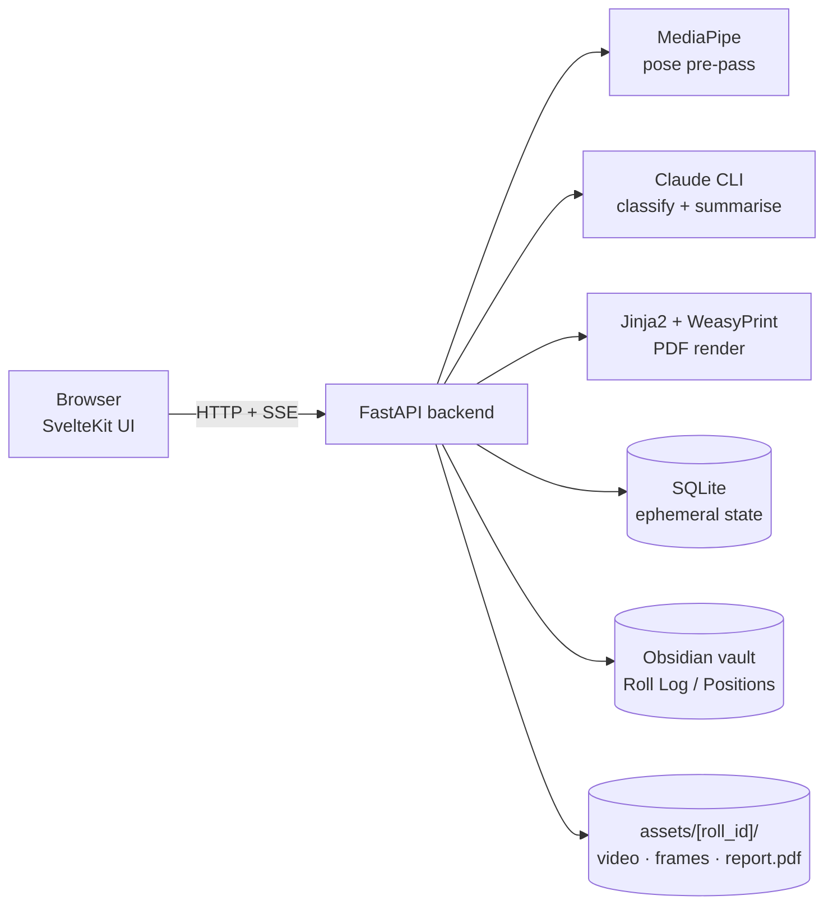

# BJJ Analysis

Obsidian vault + local web app for reviewing BJJ rolling footage. Upload a video, run per-moment Claude classification, annotate, and save a scored coaching report back to the vault as markdown — plus a printable PDF.

Runs entirely on your Mac. No cloud services, no API keys — uses the `claude` CLI signed into your Claude subscription.

## Architecture



**Per-roll flow:**

1. **Upload** video → row in SQLite, file under `assets/<roll_id>/`.
2. **Pose pre-pass** picks ~20-40 interesting moments (frames where the position changed).
3. **Classify** a moment → Claude identifies both players' positions against `tools/taxonomy.json`.
4. **Annotate** with free-text coaching notes per moment.
5. **Finalise** → one Claude call returns scores, summary, improvements, strengths, and 3 key moments.
6. **Save to Vault** → splices the summary sections into `Roll Log/<date> - <title>.md`.
7. **Export PDF** → renders a one-page white-paper match report and links it from the vault markdown.

## Quick start

One-time:

```bash
cd tools/bjj-app
brew install pango                              # for WeasyPrint
python3.12 -m venv .venv && .venv/bin/pip install -e .
cd web && npm install && npm run build
```

Run:

```bash
cd tools/bjj-app
.venv/bin/python -m uvicorn server.main:app --port 8001
# → open http://127.0.0.1:8001
```

Requires the `claude` CLI on `PATH`, signed in with an active subscription.

## Repo layout

```
.
├── tools/bjj-app/            # Live FastAPI + SvelteKit app
├── tools/taxonomy.json       # 30-position enum + categories (load-bearing)
├── tools/GrappleMap.*        # Position-graph data (future grounding feature)
├── Positions/                # Obsidian position notes — wikilink graph
├── Techniques/               # Obsidian technique notes
├── Roll Log/                 # Per-roll coaching markdown (source of truth)
├── Templates/                # Obsidian templates
├── assets/<roll_id>/         # Video + extracted frames + exported PDF
├── docs/superpowers/         # Design specs + implementation plans
└── Home.md                   # Vault dashboard
```

## Obsidian vault

Open the repo root as an Obsidian vault to explore `Positions/`, `Techniques/`, and `Roll Log/` as an interconnected knowledge graph. Start at **Home.md**.

## Status

Feature-complete against the design spec (M1 → M6b shipped; M7 mobile polish abandoned; M8 cleanup shipped). Full design history lives in `docs/superpowers/specs/` and `docs/superpowers/plans/`.
